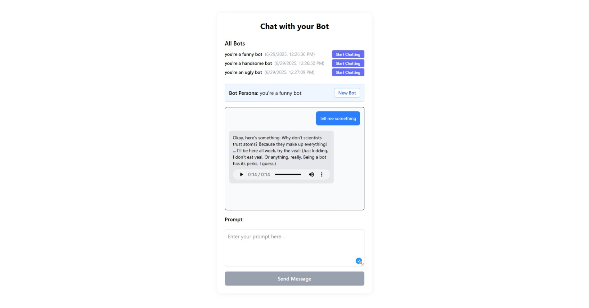

# Conversational Bot Backend

This project provides a simple yet powerful backend service to drive conversational AI applications. It leverages Google's Gemini for generative text and Google's Text-to-Speech API to convert those responses into audio.

## Features

  * **Text Generation Endpoint:** A core endpoint (`/api/generate`) that creates dynamic, human-like text responses based on a defined persona and user message.
  * **Powered by Google Gemini:** Utilizes the cutting-edge Gemini API for high-quality, context-aware text generation.
  * **Text-to-Speech Conversion:** Automatically converts the generated text response into speech audio using the Google Text-to-Speech API.
  * **Simple & Scalable:** Built with Express.js, providing a lightweight and efficient foundation for your conversational AI needs.

## How It Works

This backend service is designed to be straightforward.

1.  **API Request:** A client sends a `POST` request to the `/api/generate` endpoint. This request includes a `persona` to define the bot's character and the `message` from the user.
2.  **Generate Text:** The server receives the request and forwards the persona and message to the Google Gemini API to generate a relevant text response.
3.  **Generate Audio:** The text response from Gemini is then sent to the Google Text-to-Speech API to be converted into audio data.
4.  **API Response:** The server returns a JSON object to the client containing both the generated text and the audio output.

## Screenshots

Here's a glimpse of the bot creation interface:



## Technologies Used

  * **Backend:** Express.js
  * **AI & Machine Learning:**
      * Google Gemini API (for generative text)
      * Google Text-to-Speech API (for audio conversion)

## Getting Started

To get a local copy up and running, follow these simple steps.

### Prerequisites

  * Node.js and a package manager (npm, yarn, or pnpm) installed on your machine.
  * An API key from Google for the Gemini and Text-to-Speech APIs.

### Installation

1.  Clone the repo
    ```sh
    git clone <your-backend-repo-url>
    ```
2.  Navigate to the project directory
    ```sh
    cd <your-project-directory>
    ```
3.  Install NPM packages
    ```sh
    pnpm install
    ```
4.  Create a `.env` file in the root of your project and add your Google API key:
    ```
    GOOGLE_API_KEY="YOUR_API_KEY_HERE"
    ```
5.  Start the development server
    ```sh
    node index.js
    ```

## Usage

Once the application is running, the server will be listening for requests (typically on a port like `3000`). You can interact with the API using any HTTP client, such as `curl` or Postman.

### Endpoint: `/api/generate`

  * **Method:** `POST`
  * **Headers:**
      * `Content-Type: application/json`
  * **Request Body:**
    ```json
    {
      "persona": "A witty space explorer",
      "prompt": "Tell me about black holes."
    }
    ```
  * **Example `curl` Command:**
    ```sh
    curl -X POST http://localhost:3000/api/generate \
    -H "Content-Type: application/json" \
    -d '{"persona": "A witty space explorer", "message": "Tell me about black holes."}'
    ```
  * **Success Response (200 OK):**
    The API will return a JSON object containing the generated text and audio data (this example assumes the audio is returned as a base64 string or a public URL).
    ```json
    {
      "text": "Ah, black holes! The universe's ultimate mystery boxes. Imagine something so massive that not even light, the fastest thing we know, can escape its grasp. That's a black hole for you.",
      "audio": "<audio_data_here>"
    }
    ```